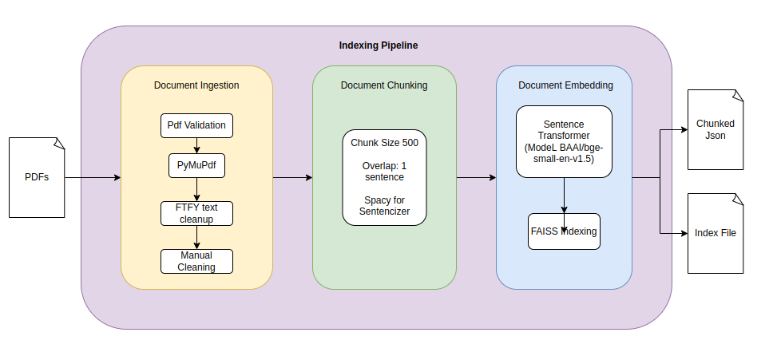
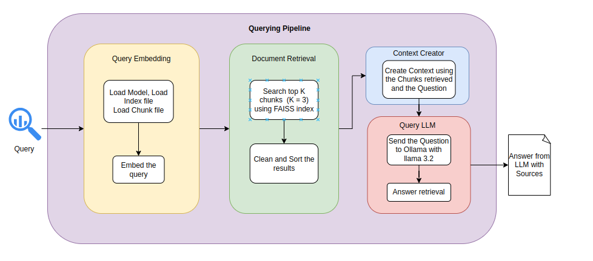

# Compiler RAG Assistant

This is a Retrieval Augmented Generation (RAG) system that helps you ask questions about compiler optimization research papers and LLVM documentation. Instead of reading through PDFs manually, you can ask a question and the system will find the relevant parts of your documents and generate an answer using an AI model.

## Development Notes
Implemented the full pipeline manually: PDF parsing, chunking, embedding generation, FAISS indexing, retrieval, answer generation, and evaluation scripts.

## Prerequisites

- Python 3
- Ollama with the `llama3.2` model
- Python packages: `pymupdf`, `sentence-transformers`, `faiss-cpu`, `ollama`, and `ftfy`

Install the Python dependencies:

```bash
pip install -r requirements.txt
```

Start Ollama and download the model before running answer tests or asking questions:

```bash
ollama pull llama3.2
```

## How to Run Locally

1. Set the PDF folder in `config.py`. The default is:

```python
PDF_DATA_PATH = "data/pdf/"
```

2. Add the PDF files to that folder.

3. Process the PDFs and build the search index:

```bash
python3 main.py index
```

4. Run retrieval and answer accuracy tests:

```bash
python3 main.py test
```

Test reports are saved in `data/test_files/` as:

- `retrieval_accuracy_<timestamp>.txt`
- `answer_accuracy_<timestamp>.txt`

5. Start the interactive question prompt:

```bash
python3 main.py run
```

Enter a question at the prompt, or enter `exit` to stop.

## How It Works

The project is organized into several modules that work together:

```
rag-researchpapers-local/
├── app/
│   ├── document_ingestion/          # Loads PDFs from disk
│   │   └── document_loader.py
│   ├── helpers/                     # Utility functions
│   │   ├── data_classes.py          # Data structures
│   │   ├── helpers.py               # File operations
│   │   └── text_cleanup.py          # Text normalization
│   ├── document_chunking/           # Breaks text into pieces
│   │   └── chunking.py
│   ├── document_embedding/          # Converts text to vectors
│   │   └── embedding.py
│   ├── document_retrieval/          # Finds relevant chunks
│   │   └── document_retrieval.py
│   ├── context_creator/             # Formats chunks for the LLM
│   │   └── context_creator.py
│   ├── llm_integration/             # Talks to the AI model
│   │   └── llm_integration.py
│   └── pipelines.py                  # Main orchestration
├── data/
│   ├── pdf/                         # Put your PDFs here
│   └── processed/                   # Generated indexes and embeddings
├── config.py                        # Settings
└── README.md
```

### Indexing Pipeline

Loads PDF documents, cleans and splits their text into chunks, creates embeddings, and stores the vectors in a FAISS index with their source metadata.



### Querying Pipeline

Embeds the user's question, retrieves the most relevant chunks from FAISS, builds a source-aware context, and sends it to Ollama to generate an answer.



## What Happens When You Index Your Documents

Here's the step-by-step process:

1. **Load PDFs** — The system reads all PDF files from your `data/pdf/` folder

2. **Clean Text** — It removes headers, footers, and formatting noise to get clean, readable text

3. **Split into Chunks** — Long documents are broken into manageable pieces (around 500 characters each) so the AI can process them

4. **Create Embeddings** — Each chunk is converted into a mathematical representation (vector) that captures its meaning. We use the BAAI/bge-small-en-v1.5 model for this

5. **Build Search Index** — All these vectors are organized into a FAISS index, which lets us quickly find similar chunks

6. **Save Everything** — The embeddings and chunk metadata are saved to `data/processed/` for future queries

## How Querying Works

When you ask a question:

1. Your question gets converted to an embedding (same way as the chunks)
2. The system searches the FAISS index to find the top 3 most similar chunks
3. These chunks are scored by relevance
4. The chunks are formatted with source information (filename, page number)
5. Everything is sent to Ollama (llama3.2) along with a system prompt
6. The LLM reads the context and generates an answer
7. You get a concise response with source attribution

## What's Happening Behind the Scenes

**Embedding Model**: We use a lightweight but effective model (BAAI/bge-small-en-v1.5) that's specifically tuned for retrieval tasks. It's fast and doesn't need a GPU.

**Vector Search**: FAISS uses inner product search with L2-normalized embeddings to find the most relevant chunks. It's super fast even with thousands of chunks.

**Local AI**: The system uses Ollama with llama3.2 running locally on your machine. No data is sent to external APIs—everything stays on your computer.
